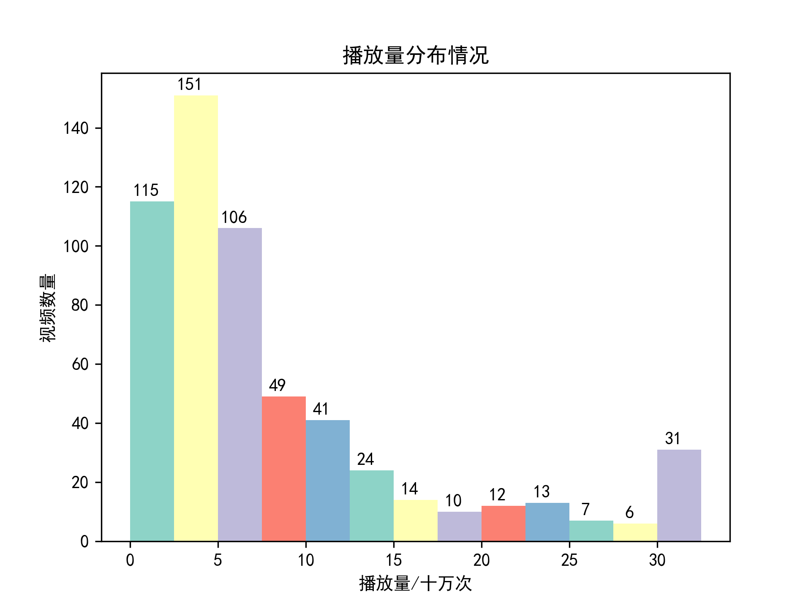
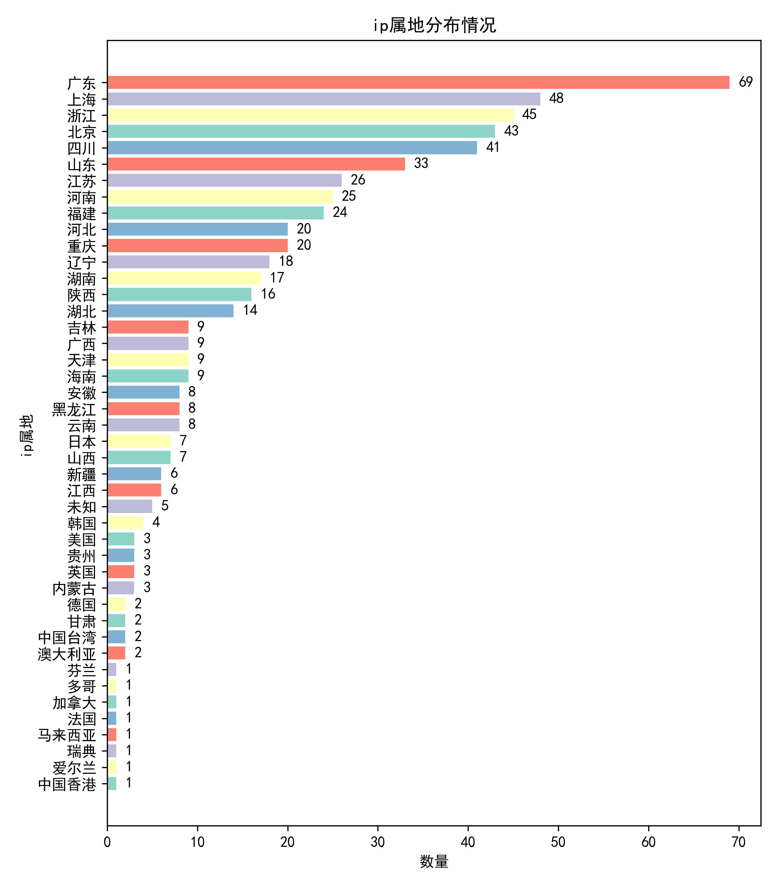
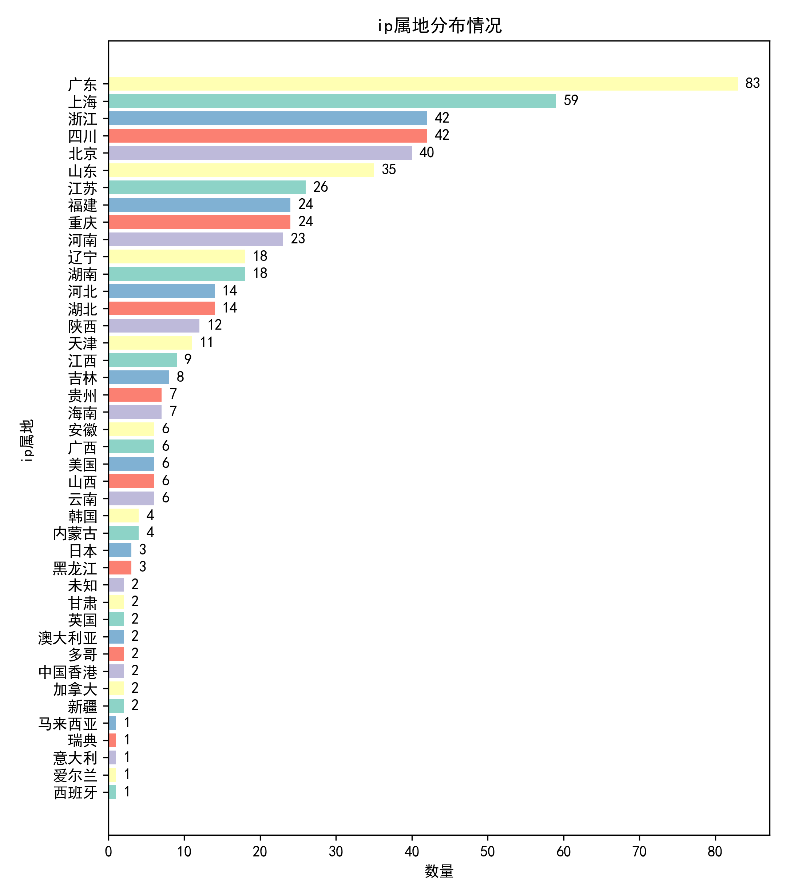

项目统计了自2023年8月25日以来B站每日的热门视频数据，数据来源于B站的API接口，每日更新一次。

由于程序没有设置Cookie，数据不存在个性化（冷知识：每个人的B站热门都不一样）。

注：
1. 每日的数据截至程序运行
2. 数据仅供学习参考
3. 如需运行项目中的程序，切记不要过度频繁使用！！！否则造成的后果与本人无关

TODO：
- [ ] ip属地存在，但获取数据为未知
- [x] 给获取信息过程加进度条
- [x] 每日部分数据可视化
- [ ] 优化文档结构
- [ ] 实现每日自动更新

## 正文：
<h2 align=center>2023-08-28 星期一</h2>

[详细数据](dailyData/2023/08/27/detail.md)

**今日视频数量：579**

### 播放量统计

    

### 视频时长统计
#### 总体：

    

#### 短视频：

    

### 子分区

    

### ip属地统计

    

<h2 align=center>2023-08-27 星期日</h2>

[详细数据](dailyData/2023/08/27/detail.md)

**今日视频数量：579**

### 播放量统计

    

### 视频时长统计
#### 总体：

    

#### 短视频：

    

### 子分区

    

### ip属地统计

    

<h2 align=center>2023-08-26 星期六</h2>

[详细数据](dailyData/2023/08/26/detail.md)

**今日视频数量：582**

### 播放量统计

    

### 视频时长统计
#### 总体：

    

#### 短视频：

    

### 子分区

    

### ip属地统计

    

<h2 align=center>2023-08-25 星期五</h2>

[详细数据](dailyData/2023/08/25/detail.md)

**今日视频数量：581**

### 播放量统计

    

### 视频时长统计
#### 总体：

    

#### 短视频：

    

### 子分区

    

### ip属地统计

    

